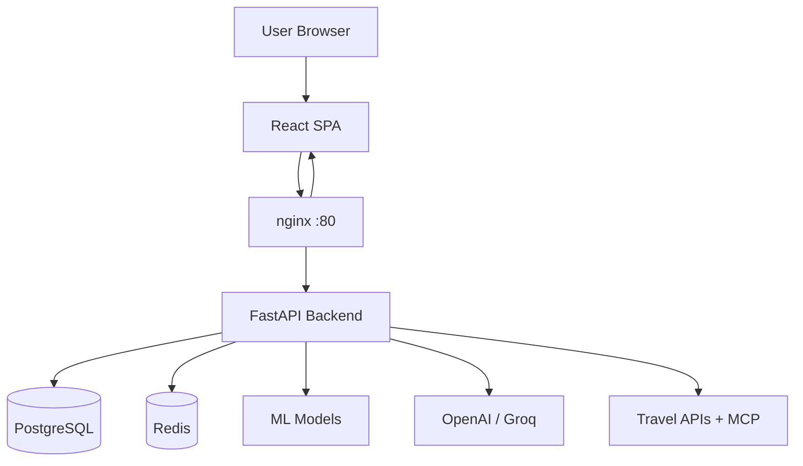
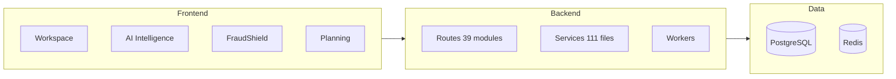
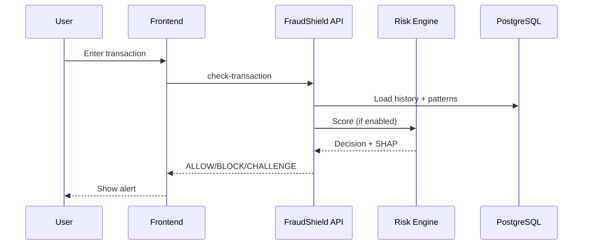

# EXIQO (SmartSpend Analytics) — Full System Architecture
## Copy-paste ready for PowerPoint

---

# SLIDE 1 — Title
**EXIQO / SmartSpend Analytics**
AI-Driven Personal Finance + Fraud Risk Platform
*Built for Indian fintech context: UPI, EMI, Festivals, ₹*

---

# SLIDE 2 — Problem We Solve
1. **Data without insight** — Raw bank PDFs/CSVs don't explain health, risk, or next steps
2. **Reactive fraud** — Losses discovered after money leaves the account
3. **Low financial self-awareness** — No unified view of savings, EMI load, leakages

---

# SLIDE 3 — Solution Overview
Turn PostgreSQL transaction history into:
- Real-time dashboards & health scores
- ML anomaly detection (Isolation Forest)
- Rule + AI fraud prevention (FraudShield, 12-phase risk engine)
- India-specific planners (EMI, festivals, purchases, family events)
- Subscription intelligence & dark-pattern detection
- AI narratives (OpenAI / Groq) + Trip Planner with MCP travel tools

---

# SLIDE 4 — Tech Stack

| Layer | Technology |
|-------|------------|
| **Frontend** | React 18, TypeScript (partial), Tailwind CSS, Recharts, Framer Motion, Axios |
| **Backend** | Python 3.11+, FastAPI, Uvicorn, Pydantic 2 |
| **Database** | PostgreSQL 15 |
| **Cache / Events** | Redis 7 (pub/sub, embeddings, cooldowns) |
| **ML** | scikit-learn, pandas, PyTorch (GNN/DNN), MLflow |
| **AI** | OpenAI (insights, chat, trip planner), Groq (fraud narratives, Phase 9–12) |
| **Documents** | pdfplumber, PyMuPDF, Tesseract OCR, openpyxl |
| **Scheduling** | APScheduler (review queue, drift, retrain, pattern alerts) |
| **Auth** | JWT + refresh tokens, bcrypt, sessions table |
| **Deploy** | Docker Compose + nginx |

---

# SLIDE 5 — High-Level System Architecture

```
┌─────────────────────────────────────────────────────────────────────────┐
│                         USER (Web Browser)                               │
│              React SPA — Intro → Auth → Onboarding → App Shell           │
└────────────────────────────────┬────────────────────────────────────────┘
                                 │ HTTPS / REST (+ SSE for insights)
                                 ▼
┌─────────────────────────────────────────────────────────────────────────┐
│                    NGINX (Port 80) — Reverse Proxy                       │
└───────────────┬─────────────────────────────────────┬───────────────────┘
                │                                     │
                ▼                                     ▼
┌───────────────────────────┐         ┌───────────────────────────────────┐
│  FRONTEND (React Build)   │         │  BACKEND (FastAPI :8000)          │
│  Port 3000 / 80           │         │  39 route modules, 111 services   │
└───────────────────────────┘         └───────────────┬───────────────────┘
                                                      │
              ┌───────────────────┬─────────────────┼─────────────────┐
              ▼                   ▼                 ▼                 ▼
     ┌─────────────┐    ┌─────────────┐   ┌─────────────┐   ┌─────────────────┐
     │ PostgreSQL  │    │   Redis     │   │ ML Models   │   │ External APIs   │
     │ (Primary DB)│    │ Events/Cache│   │ .pkl .pt    │   │ Groq, OpenAI,   │
     │             │    │             │   │ MLflow      │   │ Amadeus, Weather│
     └─────────────┘    └─────────────┘   └─────────────┘   └─────────────────┘
```

---

# SLIDE 6 — Repository Structure

```
exiqo/
├── frontend/                 ← Active React SPA (main UI)
├── backend/                  ← FastAPI app, services, workers, MCP
│   ├── routes/               ← 39 API route modules
│   ├── services/             ← 111 business logic files
│   ├── workers/              ← Background jobs (APScheduler)
│   ├── mcp_servers/          ← Travel Intelligence MCP (stdio)
│   └── database/migrations/  ← 32 SQL migrations
├── database/                 ← Base schema + seeds
├── migrations/               ← Root-level SQL migrations
├── docker-compose.yml        ← Full stack deployment
├── nginx.conf
└── presentations/            ← Demo decks & this doc
```

---

# SLIDE 7 — Frontend Application Shell

**Navigation groups (Sidebar):**

| Group | Tabs |
|-------|------|
| **Workspace** | Dashboard, Transactions |
| **AI Intelligence** | AI Insights, Subscriptions AI, FraudShield, Dark Patterns |
| **AI Actions** | Trip Planner |
| **Financial** | EMI Tracker |
| **Planning** | Festivals, Purchase Planner, Trips & Events |
| **System** | Connected Accounts (Settings) |

**FraudShield sub-tabs** (`?fraudTab=`): overview, realtime, alerts, behavior, devices, investigations, live

**State management:** AuthContext, RiskContext, SubscriptionIntelligenceContext, custom hooks

---

# SLIDE 8 — User Journey: Onboarding → Dashboard

```
IntroFlow (cinematic splash)
    → SignUp / SignIn (JWT access + refresh)
    → Background seed (1000+ demo transactions)
    → Source Selection (bank link | upload statement | skip)
    → Set dashboard mode (bank / card / merged)
    → onboarding_completed = true
    → Main App Shell → Dashboard KPIs
```

---

# SLIDE 9 — Feature Map (4 Quadrants)

```
┌─────────────────────────────┬─────────────────────────────┐
│   WORKSPACE & DATA          │   SPENDING INTELLIGENCE      │
│   • Dashboard               │   • Health Score (0–100)     │
│   • Transactions ledger     │   • ML Anomalies             │
│   • Statement upload        │   • AI Insights (GPT/Groq) │
│   • Multi-source accounts   │   • Scenario Simulator       │
│   • Connected sources       │   • Pattern Alerts           │
│   • Financial state         │   • Analysis & trends        │
├─────────────────────────────┼─────────────────────────────┤
│   FRAUD & RISK OS           │   PLANNING & LIFESTYLE       │
│   • FraudShield (pre-send)  │   • EMI Trap Detector        │
│   • 12-Phase Risk Engine    │   • Festival Predictor       │
│   • Fraud Simulator         │   • Purchase Planner         │
│   • Trust Score             │   • Family Events / Trips    │
│   • Admin MLOps             │   • Trip Planner (AI+MCP)    │
│   • GNN / DNN / Orchestrator│   • Subscription Intelligence│
│                             │   • Dark Pattern Detector    │
└─────────────────────────────┴─────────────────────────────┘
```

---

# SLIDE 10 — Core Workspace Features

| Feature | What it does |
|---------|--------------|
| **Dashboard** | Period KPIs, health score, categories, anomalies, fraud pending, last sync |
| **Transactions** | Filterable ledger, summary, CSV/PDF/XLSX upload |
| **Connected Accounts** | Multi-bank/card sources, visibility toggles, dashboard modes |
| **Settings** | Account management, dashboard mode switch |

---

# SLIDE 11 — Spending Intelligence Features

| Feature | What it does |
|---------|--------------|
| **Health Score** | 0–100 grade from savings rate, EMI load, anomalies |
| **ML Anomaly Detection** | Isolation Forest per user; patterns, alerts, run-detection |
| **AI Insights** | Monthly GPT/Groq narratives, quick summary, health narrative, SSE stream |
| **Scenario Simulator** | "What-if" projections on savings and health |
| **Analysis** | Spending by category, monthly trends, top merchants |
| **Pattern Alerts** | Proactive upcoming charges, snooze/dismiss, calendar export |
| **Financial State** | Unified state, notifications, impact log |

---

# SLIDE 12 — Debt & Subscription Features

| Feature | What it does |
|---------|--------------|
| **EMI Trap Detector** | Debt-to-income vs RBI-style safe band, affordability check |
| **Subscription Graveyard** | Unused / low-usage recurring spend detection |
| **Subscription Intelligence** | Device link, verdict engine, AI summary, smart reminders, substitutions, hub |
| **Dark Pattern Detector** | Billing tricks, rupee-trap escalation, scan & resolve |

---

# SLIDE 13 — Planning & Lifestyle (India Context)

| Feature | What it does |
|---------|--------------|
| **Festival Predictor** | Upcoming Indian festivals, budgets, history |
| **Important Days** | CRUD for personal festival/event days |
| **Purchase Planner** | Goals, milestones, EMI vs cash, postpone linkage |
| **Family Events / Trips** | Event planning tied to financial state |
| **Trip Planner** | OpenAI agent + MCP travel tools (weather, flights, hotels, places) |

---

# SLIDE 14 — FraudShield Overview

**Pre-transaction protection:**
- `POST /api/fraud-shield/{userId}/check-transaction` before payment
- Rule patterns + user history + risk score → BLOCK / ALLOW / CHALLENGE
- Alerts persisted with analyst workflow

**UI modules:**
- Transaction Checker, Real-time Feed, Alerts List, Fraud Rings graph
- Investigation Console, Live Simulator

---

# SLIDE 15 — Risk Engine: 12 Phases

| Phase | Capability |
|-------|------------|
| **1–2** | Real-time scoring, feature store (online/offline) |
| **3** | Hybrid scorer (rules + ML) |
| **4** | Decision engine (ALLOW / CHALLENGE / BLOCK) |
| **5** | SHAP explainability + humanizer |
| **6** | Review queue + analyst assignment |
| **7** | User feedback + chargeback webhook |
| **8** | Drift monitoring + shadow models + MLflow registry |
| **9** | LLM Investigation Agent (Groq + tools: geo, SHAP, blacklist) |
| **10** | GraphSAGE GNN — fraud rings, user embeddings |
| **11** | Multi-branch DNN — shadow → promote pipeline |
| **12** | Tiered orchestrator + LLM judge (cost-aware routing) |

---

# SLIDE 16 — FraudShield Data Flow

```
User initiates payment
        │
        ▼
TransactionChecker (Frontend)
        │
        ▼ POST /api/fraud-shield/{userId}/check-transaction
FraudShield Service
        ├── Rule pattern library
        ├── User behavior profile
        ├── Hybrid scorer / risk score
        └── Decision: ALLOW | CHALLENGE | BLOCK
        │
        ▼
Alert persisted → Fraud Alerts UI
        │
        ▼ (Risk Engine enabled)
Redis TRANSACTIONS_SCORED → alert_consumer
        → Review Queue (5 min cycle)
        → Phase 9 Investigation (optional)
        → Phase 12 Orchestrator (tiered)
```

---

# SLIDE 17 — Document Upload Pipeline

```
User uploads PDF / CSV / XLSX
        │
        ▼ POST /api/documents/upload
Document Parser Service
        ├── pdfplumber (text PDFs)
        ├── PyMuPDF + Tesseract OCR (scanned)
        ├── chardet (encoding detection)
        └── bank_parser + categorizer
        │
        ▼
document_ledger_merge → INSERT transactions
        │
        ▼
connected_sources updated → Dashboard reflects new data
```

---

# SLIDE 18 — AI Layer Architecture

```
┌─────────────────────────────────────────────────────────────┐
│                      AI FEATURES                             │
├─────────────────┬─────────────────┬─────────────────────────┤
│ OpenAI          │ Groq            │ MCP Travel Server       │
│ • Monthly       │ • Fraud         │ • Weather (OpenWeather) │
│   insights      │   narratives    │ • Flights (Amadeus)     │
│ • AI Chatbot    │ • EMI / Sub /   │ • Hotels (RapidAPI)     │
│ • Trip Planner  │   Dark pattern  │ • Places search         │
│   (function     │   copy          │                         │
│    calling)     │ • Phase 9–12    │                         │
│                 │   LLM agent     │                         │
└─────────────────┴─────────────────┴─────────────────────────┘
         │                  │                    │
         └──────────────────┴────────────────────┘
                            ▼
                   ai_context_service
                   (bundles user DB context)
```

---

# SLIDE 19 — Backend API Domains (120+ endpoints)

| Domain | Prefix | Key capabilities |
|--------|--------|------------------|
| Auth | `/api/auth` | signup, signin, refresh, logout, me |
| Dashboard | `/api/dashboard` | KPIs, source breakdown, dedupe |
| Transactions | `/api/transactions` | ledger, summary, upload |
| Analysis | `/api/analysis` | spending, trends, merchants, simulate |
| Anomalies | `/api/anomalies` | patterns, alerts, run-detection |
| Health Score | `/api/health-score` | score + history |
| Insights | `/api/insights` | narratives, SSE stream, simulate |
| EMI | `/api/emi` | scan, affordability, postpone |
| Subscriptions | `/api/subscriptions` | graveyard |
| Sub Intelligence | `/api/subscription-intelligence` | hub, verdicts, reminders |
| Dark Patterns | `/api/dark-patterns` | scan, rupee-traps, resolve |
| Fraud Shield | `/api/fraud-shield` | check, alerts, rings |
| Simulator | `/api/simulator` | live fraud demo feed |
| Festivals | `/api/festivals` | budgets, important days |
| Purchases | `/api/purchases` | goals, milestones, postpone |
| Financial State | `/api/financial-state` | state, notifications, events |
| Pattern Alerts | `/api/pattern-alerts` | generate, snooze, dismiss |
| Documents | `/api/documents` | upload, history |
| AI Chat | `/api/ai` | session chat + doc upload |
| Trip Planner | `/api/ai-actions/trip-planner` | SSE chat |
| Risk (Phases) | `/api/risk/*` | profile, investigations, GNN, DNN, orchestrator |
| Admin | `/api/admin` | models, drift, blacklist, review queue |
| Webhooks | `/api/webhooks` | chargeback ingestion |

---

# SLIDE 20 — Database Entity Model (Core)

```
users (1) ──────< transactions
  │                    │
  │                    ├──< alerts, fraud_feedback
  │                    └──< shadow_predictions
  │
  ├──< bank_connections, sessions, connected_sources
  ├──< fraud_alerts, purchase_goals, festival_budgets
  ├──< emi_records, subscriptions, dark_patterns
  ├──< pattern_alerts, family_events, notifications
  ├──< device_links, connected_apps (subscription intel)
  ├──< risk_investigations, review_queue
  └──< monthly_summary, spending_patterns

merchants ── merchant_risk_config, blacklisted_entities

Extended (migrations): feature_snapshots, model_deployments,
drift_reports, gnn_user_embeddings, dnn_training_runs,
orchestration_decisions, ai_sessions, document_uploads, otp_verifications
```

---

# SLIDE 21 — Authentication Flow

```
1. POST /api/auth/signup or /signin
2. bcrypt password hash verified
3. JWT access token (short) + refresh token (long) issued
4. Stored in localStorage: smartspend_access_token, smartspend_refresh_token
5. Axios interceptor attaches Bearer token on every request
6. 401 response → auto refresh → retry original request
7. Sessions table tracks refresh tokens; logout invalidates
8. Admin routes: X-Admin-Token header
9. Onboarding gate: SourceSelection before main shell
```

---

# SLIDE 22 — Background Workers & Schedulers

| Worker | Schedule | Purpose |
|--------|----------|---------|
| review_queue_worker | Every 5 min | Assign fraud review items to analysts |
| drift_monitor_worker | Hourly | PSI drift detection on models |
| feature_materializer | Every 15 min | Refresh online feature store |
| retrain_scheduler | Sunday 02:00 UTC | Weekly model retrain + shadow/canary |
| retrain_feed_consumer | Continuous | Retrain on feedback threshold |
| alert_consumer | Redis stream | Dispatch HIGH/CRITICAL alerts |
| pattern_alerts | Every 6h (optional) | Scan all users for upcoming charges |
| ML warmup | App startup | Train Isolation Forest for all users |

---

# SLIDE 23 — Third-Party Integrations

| Service | Purpose | Required? |
|---------|---------|-----------|
| PostgreSQL | Primary datastore | Yes |
| Redis | Events, embeddings, cooldowns | Yes (risk engine) |
| OpenAI | Insights, chat, trip planner | No (fallbacks) |
| Groq | Fraud narratives, Phase 9–12 | No (fallbacks) |
| OpenWeatherMap | Trip weather | No |
| Amadeus | Flight search | No |
| RapidAPI (Booking) | Hotels | No |
| MLflow | Model registry | No |
| Tesseract | OCR for scanned PDFs | No |
| MCP (stdio) | Travel tool host | No (Python fallbacks) |

**Banking:** Simulated bank link + statement upload (no real open-banking API)

---

# SLIDE 24 — Deployment Architecture (Docker)

```
docker compose up --build

┌──────────┐   ┌──────────┐   ┌──────────┐   ┌──────────┐   ┌──────────┐
│  nginx   │──▶│ frontend │   │ backend  │──▶│ postgres │   │  redis   │
│  :80     │   │  :3000   │   │  :8000   │   │  :5432   │   │  :6379   │
└──────────┘   └──────────┘   └──────────┘   └──────────┘   └──────────┘

Public URL: http://localhost/
API Docs:   http://localhost/docs (via nginx proxy)
```

---

# SLIDE 25 — Security & Compliance Highlights

- JWT access + refresh with session invalidation on logout
- bcrypt password hashing (passlib)
- Rate limiting on auth endpoints
- PII redactor in risk engine services
- Admin token + optional ADMIN_USER_IDS for MLOps routes
- Webhook secret validation for chargeback ingestion
- CORS configured via CORS_ORIGINS
- Graceful degradation when API keys missing

---

# SLIDE 26 — Frontend Pages & Components (Inventory)

**Pages (19):** SourceSelection, SubscriptionConnect, SubscriptionHub, AIAnalysisEngine, SmartReminderEngine, TripPlannerPage, AdminDiagnostics, AlertsCenter, BehaviorProfile, DeviceTrust, InvestigationViewer, AIPerformance, GNNTrainingPanel, DNNShadowReport, OrchestratorDashboard, TrustCenter

**Major component folders:**
- Dashboard/, FraudShield/, EMI/, Purchase/, Festival/, DarkPatterns/
- FamilyEvents/, Subscriptions/, Charts/, Upload/, Simulator/
- AIChat/, AIActions/, intro/, Layout/, risk/, common/

---

# SLIDE 27 — Backend Services (111 files — grouped)

| Package | Role |
|---------|------|
| ml_model.py | Isolation Forest anomaly detection |
| scorer.py, hybrid_scorer.py | Health & hybrid fraud scoring |
| decision_engine.py | Rule-based risk decisions |
| openai_service.py, ai_service.py | GPT/Groq clients |
| bank_parser, pdf_parser, monster_extraction | Upload pipeline |
| subscription_intelligence/* | Verdicts, reminders, substitutions |
| phase_9_agent/* | LLM investigator + tools |
| phase_10_gnn/* | Graph builder, trainer, inference |
| phase_11_dnn/* | DNN model, trainer, shadow |
| phase_12_orchestrator/* | Tiered routing + LLM judge |
| feature_store/* | Online/offline features |
| explainability/* | SHAP + humanizer |
| trip_planner/* | Agent, MCP client, travel APIs |
| event_bus/* | Redis pub/sub |
| monitoring/* | Drift, shadow, metrics |
| ml_registry/* | MLflow model registry |

---

# SLIDE 28 — Key User Journeys (Summary)

| Journey | Flow |
|---------|------|
| **Signup → Dashboard** | Intro → Auth → Seed → Source Selection → Dashboard |
| **Monthly Insights** | Insights tab → GET insights → GPT narrative |
| **Fraud Check** | Enter txn → FraudShield check → Alert/Block |
| **Statement Upload** | Upload PDF → Parse → Merge → Transactions |
| **Subscription Intel** | Device link → Hub → Verdicts → Reminders |
| **Trip Planning** | Chat → OpenAI tools → MCP travel data |
| **EMI Decision** | EMI scan → Affordability → Link to purchase postpone |

---

# SLIDE 29 — Demo Path (Hackathon)

1. Sign up → cinematic intro → source selection
2. Dashboard — switch month/year, show KPIs
3. FraudShield → Check transaction (KYC, lottery, collect quick tests)
4. AI Insights — monthly narrative
5. EMI Tracker — DTI vs safe band
6. Purchase Planner — milestone timeline
7. Festival — urgency strip + budget
8. Subscriptions AI — device link → hub → verdicts
9. Trip Planner — ask for Goa trip budget
10. Mention graceful degradation without API keys

---

# SLIDE 30 — Closing / Value Proposition

**EXIQO transforms raw financial data into proactive decisions**

- **Before money leaves:** FraudShield + 12-phase risk engine
- **Before month ends:** Pattern alerts + festival/purchase planners
- **Before EMI traps:** RBI-style affordability bands
- **Before subscription waste:** Intelligence hub + smart reminders

*From raw transactions to decisions before money is lost.*

---

## Mermaid diagrams (paste into draw.io, Mermaid Live, or screenshot for PPT)

### System context


### Feature layers


### Fraud pipeline

